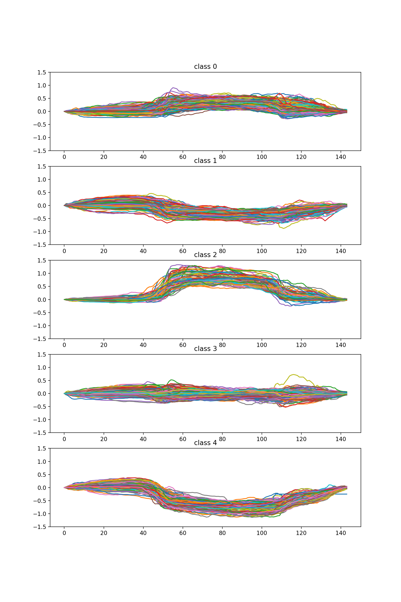

# 따릉이 자전거 정류소의 거치량은 주변 시설에 영향을 받을까

##### 이든솔(Party4Bread)

## 주제 설명

서울특별시 공공자전거 따릉이의 어떤 자전거 정류소에 특정 시간에 거치된 자전거 대수는 인근에 다른 교통망 혹은 시설과 관련이 있을지 분석합니다. 

##예상 결과

특정 시설에 가까운 정류소가 아침 출근 시간과 저녁 퇴근 시간에 영향을 받고, 이는 이용자기 몰리는 시설 근처의 거치 수가 늘어나고 이용자가 줄어드는 시설 근처의 거치 수가 줄 것이라 예상됩니다. 

## 데이터 출처(링크)

1. [서울특별시 공공자전거 실시간 대여정보](http://data.seoul.go.kr/dataList/datasetView.do?infId=OA-15493&srvType=A&serviceKind=1&currentPageNo=1)에서 10분 단위로 크롤링하여 수집한 자료
2. [서울시 주거지역 위치정보](https://data.seoul.go.kr/dataList/datasetView.do?infId=OA-13158&srvType=S&serviceKind=1&currentPageNo=1)
3. [서울시 상업지역 위치정보](https://data.seoul.go.kr/dataList/datasetView.do?infId=OA-13160&srvType=S&serviceKind=1&currentPageNo=1)
4. [서울시 공업지역 위치정보](https://data.seoul.go.kr/dataList/datasetView.do?infId=OA-13162&srvType=S&serviceKind=1&currentPageNo=1)
5. [서울시 지하철 호선별 역별 시간대별 승하차 인원 정보](https://data.seoul.go.kr/dataList/datasetView.do?infId=OA-12252&srvType=S&serviceKind=1&currentPageNo=1)

## 전처리 과정

1. 1,391개 따릉이 정류소의 데이터를 UTC에서 KST로 바꾸고 하루 단위로 나누어서 배열에 저장합니다.
 2. 저장된 데이터를 정류소마다 하루의 시작 대수가 0이 되도록 배열의 맨 앞 값을 하루 전체에서 빼 주고 이 값들을 평균을 내어 하루 평균 거치량을 계산합니다. 결과적으로 1,391개 정류소 각각의 10분 간격 기록 평균치인 1391x144 크기의 배열이 나옵니다.
 3. 저장된 데이터를 최대한 0-1 사이의 값으로 만들기 위해 어떤 정거장에서 최대한 고정거치 가능한 양만큼 나누어 줍니다.
 4. 해당 데이터에서 평균치에서 크게 벗어나는 케이스를 필터링 하기 위해 IsolationForest 알고리즘으로 outlier들을 탐지합니다. 이때 기준점은 한 정류소의 그래프를 144차원 점으로 간주하여 계산합니다.
 5.  outlier들을 제외하고 남은 inlier들을 k-means clustering을 통하여 임의의 군으로 묶습니다. 이때 임의의 군은 여러 번의 시행착오를 통하여 값들을 대표하기 좋은 묶음으로 하였고 이번에는 5개로 하였습니다. 마찬가지로 기준점은 144차원 점입니다.
 6. 지하철 정류소의 데이터를 어떤 역에서 탄 사람은 다시 어떤 역으로 돌아온다는 가정하에 어떤 시각에 N역에서 탑승한 승객은 N역 이용 인원에서 더하고 하차한 승객은 빼서 시간당 누적 이용 인원을 구합니다.
 7.  누적 이용 인원을 최대한 0-1 사이의 값으로 만들기 위해서 이용 승객 데이터의 최대치로 나누어 줍니다. 이때 이용 승객 자체가 아주 작은 역의 값이 민감해지거나 강조되는 것을 막기 위해서 최대 누적 이용자 수 300000 이하는 300000으로 나눕니다.
 8.  따릉이 정류소 처리와 같이 IsolationForest와 k-means clustering을 수행하여 5개의 군과 1개의 예외 군으로 나눕니다.

## 분석 내용

자전거 정류소의 클러스터링 결과는 다음과 같습니다.

각 군은 대략 다음과 같은 값을 나타냅니다.

0군은 출근 시간에 거치량이 약간 늘어나는 집단이고 1군은 거치량이 출근 시간에 거치량이 줄어드는 집단이고 2군은 출근 시간에 거치량이 많이 증가하는 집단이고 3군은 하루종일 거치량의 변화가 별로 없거나 변화량이 너무 다양하여 평균값으로 나타나지지 않은 집단, 4군은 출근 시간에 거치량이 많이 감소하는 집단으로 나누어진 것을 볼 수 있습니다. 

지하철 정류소의 클러스터링 결과는 다음과 같습니다.

이는 대략 다음과 같은 값을 나타냅니다.

0군은 따릉이 3군과 비슷한 경우, 1군은 따릉이 2군과 비슷한 경우, 2군은 따릉이 4군과 비슷한 경우, 3군은 따릉이 0군, 4군은 따릉이 1군과 비슷한 집단입니다.

이를 지도에 그려 cartography로 나타낸 것은 [이 사이트](https://party4bread.carto.com/builder/cf73895c-5010-42fa-bda7-80c44f5276d7/embed)에서 볼 수 있습니다.

하지만 cartography로는 결과가 명료하게 와닿지 않기에 따로 통계를 내야 합니다.

 그래서 위도와 경도를 평면 좌표계의 두 축으로 보아서 역과 따릉이 정거장의 거리가 0.00001 이하면 연관 있는 정류장으로 간주하고 각 군의 출현 빈도의 합을 각 군의 총 개수 씩 나누어서 그래프로 나타냈습니다.

출근 시간에 약간 주차량이 늘어나는 0군은 지하철 역 근처에서 흔히 볼 수 있습니다. 특이한 점은 아침에 승객이 많이 내리는 2군의 역은 아침의 거치량이 많이 늘어나는 2군 정류소가 근처에 거의 없었고 반대로 아침에 승객이 많이 승차하는 1군에서는 2군이 극명하게 4군에 비해 많이 있는 걸 볼 수 있습니다. 

## 분석 결론

예상했던 대로 지하철에 가까운 정류소가 아침 출근 시간과 저녁 퇴근 시간에 영향을 받고, 이는 승차객이 몰리는 시설 근처의 거치 수가 늘어나는 따릉이 거치소가, 거치 수가 감소하는 따릉이 거치소보다 많고, 하차객이 몰리는 시설 근처에는 거치 수가 늘어나는 따릉이 거치소가, 거치 수가 감소하는 따릉이 거치소보다 적은 것을 통하여 지하철 승하차객은 역 근처 따릉이 거치소 거치율에 큰 영향을 갖는다는 것을 알 수 있습니다. 

## 느낀점

뻔한 예상, 뻔한 결론이라 다소 지루할 거라 생각했지만 의외로 즐거웠습니다. 국소적인 자료 해석이 아니라 전체의 전반적인 경향에 대해서 조사하는 것은 색다른 경험이었고, 단순한 논리로 검증 가능한 것을 실제 수치로 나타내어보는 것은 생각보다 어렵다는 느낌을 받았습니다.

 
